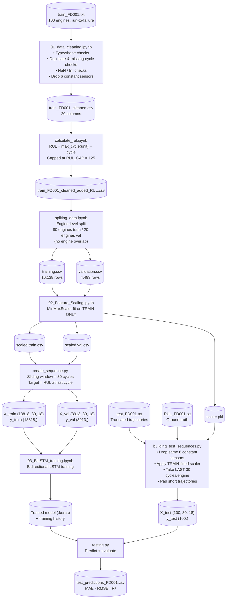
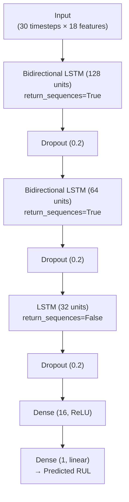

# Turbofan Engine Remaining Useful Life (RUL) Prediction

**A Bidirectional LSTM pipeline for predicting Remaining Useful Life (RUL) of aircraft turbofan engines using the NASA C‑MAPSS FD001 dataset.**

[](https://www.python.org/)
[](https://www.tensorflow.org/)
[](https://scikit-learn.org/)
[](#license)

---

## Table of Contents

- [Overview](#overview)
- [Problem Statement](#problem-statement)
- [Dataset](#dataset)
- [Pipeline Architecture](#pipeline-architecture)
- [Feature Engineering](#feature-engineering)
- [Model Architecture](#model-architecture)
- [Training Configuration](#training-configuration)
- [Results](#results)
- [Repository Structure](#repository-structure)
- [Getting Started](#getting-started)
- [Reproducing the Pipeline](#reproducing-the-pipeline)
- [Design Decisions & Rationale](#design-decisions--rationale)
- [Future Improvements](#future-improvements)
- [License](#license)

---

## Overview

This project implements an end-to-end **predictive maintenance** pipeline that estimates how many operational cycles remain before a turbofan engine is likely to fail (**Remaining Useful Life — RUL**), using multivariate sensor time-series data.

The pipeline covers the complete ML lifecycle:

**Raw sensor logs → Cleaning → RUL Labeling → Train/Val Split → Scaling → Sequence Windowing → Bidirectional LSTM Training → Evaluation on NASA's Official Test Set**

The final model is a stacked **Bidirectional LSTM** regressor that consumes 30-cycle sliding windows of 18 sensor/operational-setting features and outputs a single scalar RUL estimate.

## Problem Statement

Turbofan engines degrade gradually over their operational life. Run-to-failure sensor data (temperatures, pressures, fan speeds, etc.) captured during each flight cycle carries a degradation signature that precedes catastrophic failure. Framing this as a **supervised regression problem** — predicting cycles-until-failure from a rolling window of recent sensor readings — enables condition-based maintenance instead of fixed-interval servicing, reducing both unplanned downtime and unnecessary part replacement.

## Dataset

This project uses **NASA's C-MAPSS FD001** subset (Commercial Modular Aero-Propulsion System Simulation):

| File | Description |
|---|---|
| `train_FD001.txt` | 100 engines, run from healthy state to failure (run-to-failure trajectories) |
| `test_FD001.txt` | 100 engines, trajectories truncated *before* failure |
| `RUL_FD001.txt` | Ground-truth remaining cycles for each engine in the test set |

Each row of raw data represents one operational cycle and contains **26 columns**:

- `unit_id` — engine identifier
- `cycle` — operational cycle number
- `setting_1`, `setting_2`, `setting_3` — operational settings
- `sensor_1` … `sensor_21` — 21 sensor channels (temperatures, pressures, speeds, ratios, etc.)

## Pipeline Architecture



**Key architectural principle:** the `MinMaxScaler` is fit **exclusively on the training partition** and reused (never refit) on validation and the official test set — preventing data leakage from val/test statistics into the model.

## Feature Engineering

### 1. Constant-sensor removal
During EDA (`01_data_cleaning.ipynb`), six sensors were found to have **exactly one unique value** across the entire training set — carrying zero predictive signal:

| Sensor | Unique values |
|---|---|
| `sensor_1`, `sensor_5`, `sensor_10`, `sensor_16`, `sensor_18`, `sensor_19` | 1 |

These were dropped, reducing the raw feature space from **24 → 18** usable features (3 operational settings + 15 sensors — after also excluding IDs and target):

```
setting_1, setting_2, setting_3,
sensor_2, sensor_3, sensor_4, sensor_6, sensor_7, sensor_8, sensor_9,
sensor_11, sensor_12, sensor_13, sensor_14, sensor_15, sensor_17,
sensor_20, sensor_21
```

### 2. RUL labeling & capping
For each engine, `RUL = max_cycle_for_that_engine − current_cycle`, then **clipped at 125 cycles**. Capping reflects the well-established assumption (standard in C-MAPSS literature) that engine health is effectively constant during the early "healthy" regime, and degradation only becomes informative closer to failure — this prevents the model from wasting capacity trying to regress an arbitrarily large, low-signal RUL value early in an engine's life.

### 3. Engine-level train/validation split
Rather than a random row-wise split (which would leak cycles from the *same engine* into both partitions), the split is performed **at the engine ID level**: engines 1–80 → training, engines 81–100 → validation, with an explicit assertion that the ID sets have **zero overlap**.

### 4. Scaling
`MinMaxScaler` fit once on the training feature matrix and persisted (`joblib`) for consistent reuse on validation and the held-out official test set.

### 5. Sequence windowing
A **sliding window of 30 cycles** converts the tabular per-cycle data into 3D tensors `(samples, 30, 18)` suitable for recurrent modeling, with the regression target being the RUL at the final cycle of each window. Engines with fewer than 30 recorded cycles are excluded from training/validation sequence generation.

### 6. Official test-set construction
The official NASA test trajectories are pre-truncated (they stop *before* failure), so the standard sliding-window approach doesn't apply. Instead, `building_test_sequences.py`:
- Drops the same 6 constant sensors
- Applies the **training-fitted** scaler (never refit)
- Takes the **last 30 cycles** of each engine's trajectory (the window immediately preceding truncation — most informative for RUL estimation)
- **Pads** engines with fewer than 30 recorded cycles by repeating their first row backward
- Applies the same RUL cap (125) to the ground-truth labels from `RUL_FD001.txt`

## Model Architecture

A stacked **Bidirectional LSTM** regressor, implemented in Keras/TensorFlow:



| Layer | Output Shape | Parameters |
|---|---|---|
| Bidirectional LSTM (128) | (30, 256) | 150,528 |
| Dropout (0.2) | (30, 256) | 0 |
| Bidirectional LSTM (64) | (30, 128) | 164,352 |
| Dropout (0.2) | (30, 128) | 0 |
| LSTM (32) | (32,) | 20,608 |
| Dropout (0.2) | (32,) | 0 |
| Dense (16, ReLU) | (16,) | 528 |
| Dense (1, linear) | (1,) | 17 |
| **Total** | | **336,033 trainable params (1.28 MB)** |

**Design rationale:**
- **Bidirectional layers** for the first two stacked LSTMs let the network learn degradation patterns using context from *both* directions of the 30-cycle window before compressing to a single vector via the final unidirectional `LSTM(32)`.
- **Dropout (0.2)** after every recurrent block combats overfitting on a comparatively small dataset (100 engines).
- A narrow **Dense(16, ReLU) → Dense(1)** regression head maps the learned temporal representation to a scalar RUL.

## Training Configuration

| Hyperparameter | Value |
|---|---|
| Optimizer | Adam (`lr=0.001`) |
| Loss | Mean Squared Error (MSE) |
| Metric | Mean Absolute Error (MAE) |
| Batch size | 64 |
| Max epochs | 100 (early-stopped at **42**) |
| Random seed | 42 |

**Callbacks:**
- `EarlyStopping` — monitors `val_loss`, patience 12, restores best weights
- `ReduceLROnPlateau` — halves LR on `val_loss` plateau, patience 5, min LR `1e-5`
- `ModelCheckpoint` — persists the best `val_loss` checkpoint

## Results

### Validation set (20 held-out engines, 3,913 windows)

| Metric | Value |
|---|---|
| **MAE** | 9.50 cycles |
| **RMSE** | 12.95 cycles |
| **R²** | 0.904 |

- Final train MAE: 10.05 · Final val MAE: 9.85 → **train/val gap ≈ −0.2 cycles**, indicating the model is *not* overfitting (validation error tracks training error closely).

### Official NASA test set (`test_FD001.txt`, 100 engines)

Evaluated end-to-end via `testing.py` against the officially provided `RUL_FD001.txt` ground truth, using the exact same scaler and constant-sensor removal as training — results are written to `test_predictions_FD001.csv` (per-engine actual vs. predicted RUL) alongside console-reported MAE / RMSE / R².

> Run `testing.py` after building the official test sequences to reproduce the exact MAE / RMSE / R² for your trained checkpoint — this keeps the README numbers always in sync with the current model artifact rather than a stale snapshot.

## Repository Structure

```
.
├── CMAPSSData/
│   ├── Raw/
│   │   ├── train_FD001.txt
│   │   ├── test_FD001.txt
│   │   └── RUL_FD001.txt
│   └── Processed/              # generated CSVs, .npy sequences, scaler.pkl
├── Models/
│   └── Reduced_Sensor_Capped/
│       ├── LSTM_FD001_reduced_capped_best.keras
│       ├── LSTM_FD001_reduced_capped_final.keras
│       └── LSTM_FD001_reduced_capped_history.npz
├── notebooks/
│   ├── 01_data_cleaning.ipynb          # EDA, constant-sensor removal
│   ├── calculate_rul.ipynb             # RUL labeling + capping
│   ├── spliting_data.ipynb             # engine-level train/val split
│   ├── 02_Feature_Scaling.ipynb        # MinMaxScaler fit/transform
│   └── 03_BiLSTM_training.ipynb        # model build, train, evaluate
├── create_sequence.py                  # sliding-window sequence builder (train/val)
├── building_test_sequences.py          # official test-set sequence builder
├── testing.py                          # official test-set evaluation script
└── README.md
```

## Getting Started

### Prerequisites

```bash
pip install pandas numpy scikit-learn tensorflow joblib matplotlib
```

### Download the data

Download the C-MAPSS FD001 files (`train_FD001.txt`, `test_FD001.txt`, `RUL_FD001.txt`) from the [NASA Prognostics Data Repository](https://www.nasa.gov/intelligent-systems-division/discovery-and-systems-health/pcoe/pcoe-data-set-repository/) and place them under `CMAPSSData/Raw/`.

## Reproducing the Pipeline

Run the stages in this exact order — each stage's output CSV/pickle is a required input for the next:

```bash
# 1. Clean raw training data (drops constant sensors, validates integrity)
jupyter nbconvert --to notebook --execute 01_data_cleaning.ipynb

# 2. Compute per-cycle RUL labels and cap at 125
jupyter nbconvert --to notebook --execute calculate_rul.ipynb

# 3. Engine-level train/validation split (80/20 engines, no overlap)
jupyter nbconvert --to notebook --execute spliting_data.ipynb

# 4. Fit MinMaxScaler on train only; transform train + val
jupyter nbconvert --to notebook --execute 02_Feature_Scaling.ipynb

# 5. Build 30-cycle sliding-window sequences for train + val
python create_sequence.py

# 6. Train the Bidirectional LSTM model
jupyter nbconvert --to notebook --execute 03_BiLSTM_training.ipynb

# 7. Build the OFFICIAL held-out test sequences (uses the train-fitted scaler)
python building_test_sequences.py

# 8. Evaluate the trained model on the official NASA test set
python testing.py
```

## Design Decisions & Rationale

| Decision | Why |
|---|---|
| Engine-level (not row-level) train/val split | Prevents leakage of a single engine's degradation trajectory across both partitions |
| Scaler fit on train only | Standard practice to avoid val/test statistics leaking into feature normalization |
| RUL capped at 125 | Focuses model capacity on the degradation-relevant regime; avoids penalizing the model for the early "flat" healthy-life region |
| Bidirectional stacked LSTM | Captures degradation context from both temporal directions within each 30-cycle window before compressing to a fixed-length representation |
| Last-30-cycle window for official test (with backward padding for short trajectories) | Matches training window length while respecting each test engine's pre-failure truncation point |
| EarlyStopping + ReduceLROnPlateau + ModelCheckpoint | Standard combination for stable convergence and avoiding overfitting on a relatively small (100-engine) dataset |

## Future Improvements

- Extend to the harder FD002–FD004 subsets (multiple operating conditions / fault modes)
- Add attention mechanisms on top of the LSTM stack for interpretability of which cycles drive the RUL estimate
- Explore piecewise-linear RUL targets instead of a hard cap
- Add k-fold cross-validation across engine IDs for a more robust performance estimate
- Package inference as a lightweight REST API for real-time RUL scoring

## License

This project is licensed under the MIT License — see the `LICENSE` file for details. The C-MAPSS dataset itself is provided by NASA's Prognostics Center of Excellence and is subject to its own terms of use.

---

*Built by Pranav — Computer Engineering, NMIMS MPSTME.*
